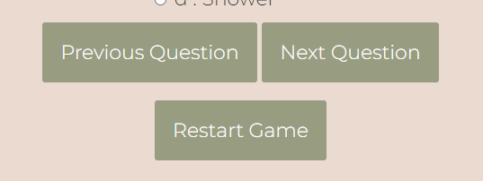
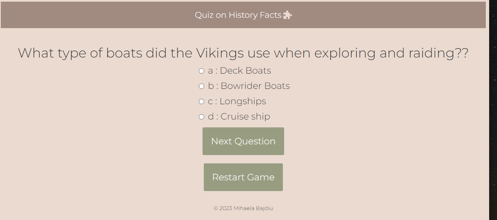

<h1>Quiz on history facts</h1>

Quiz on history facts website is a form of game or mind sport in which players attempt to answer questions correctly on history topic.

The website can be used as a brief assessment in education and similar fields to measure growth in knowledge or simply as a hobby..

<h1>Features</h1>
<h2>Existing features</h2>
<h3> 1. Navigation Buttons</h3>

The three complete responsive navigation buttons, includes links to the Next Question, Previous Question, and Restart Game, makes it simple to navigate.

With the help of this section, users will be able to navigate between questions and simply reset the quizz by pressing Restart Game.

 

<h3>2. The game page</h3>
 
The design of the game page is simple, allowing the user to proceed from question to question by clicking a Next Button, and receive a simple feedback highlighted in green if the answer is correct or red if the answer is incorrect.

  

<h2>Features Left to Implement</h2>

A congratulations message at the end

<h1>Testing</h1>

-The 3 navigation buttons "Previous Question", "Next Question", "Restart Game",are functional once pressed.

<h2>Validator testing</h2>
<h2>1. HTML</h2>

No errors were returned when passing through the official W3C validator.

<h2>2. CSS</h2>

No errors were found when passing through the official (Jigsaw) validator.

<h2>Jshint</h2>

Error unable to fix:	'const' is available in ES6 (use 'esversion: 6') or Mozilla JS extensions (use moz).

<h1>Deployment</h1>

The site was deployed to GitHub pages. The steps to deploy are as follows:

1. In the GitHub repository, navigate to the Settings tab;

2. From the source section drop-down menu, select the Master Branch;

3. Once the master branch has been selected, the page will be automatically refreshed with a detailed ribbon display to indicate the successful deployment.;

4. The live link can be found here https://mihaelab91.github.io/my-quizz-game/

<h1>Credits</h1>

Fonts were imported from website https://fonts.google.com/

Icon was imported from https://fontawesome.com/

Cursor idea was taken from  https://developer.mozilla.org/en-US/docs/Web/CSS/cursor

Reset button idea was taken from https://teamtreehouse.com/community/any-one-know-how-to-make-a-restart-button  

Color scheme idea was taken from https://www.pinterest.ie/liinamaria/trivia-game-inspiration/ 

Code idea was taken from https://gist.github.com/marclenoc/88ac347323a0d554cec026b4cc900e17 

Media query idea was taken from https://www.w3schools.com/css/css_rwd_mediaqueries.asp

